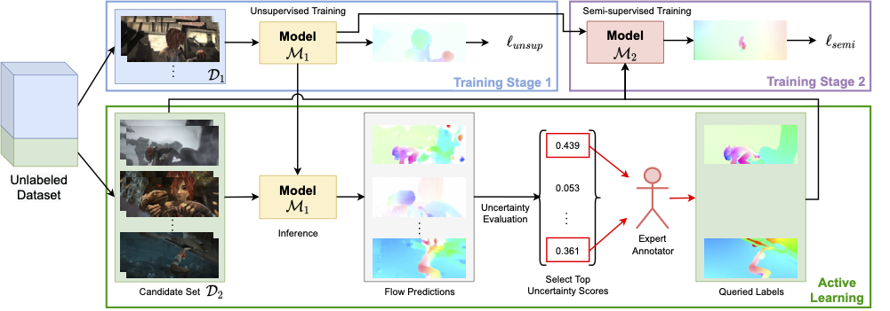

# Optical Flow Training under Limited Label Budget via Active Learning (ECCV-2022)

 

This repository contains the PyTorch implementation of our paper titled [*Optical Flow Training under Limited Label Budget via Active Learning*](https://arxiv.org/pdf/2203.05053), which has been accepted by ECCV-2022.



[**Poster**](https://users.cs.duke.edu/~shuai/publications/yuan2022optical_poster.pdf) | [**Video (YouTube)**](https://youtu.be/AwRRwSJGVJE) | [**Video (Bilibili)**](https://www.bilibili.com/video/BV1LB4y1Z7nx)

## Citation
```
@InProceedings{yuan2022optical,
  title =     "Optical Flow Training Under Limited Label Budget via Active Learning",
  author =    "Yuan, Shuai and Sun, Xian and Kim, Hannah and Yu, Shuzhi and Tomasi, Carlo",
  booktitle = "European Conference on Computer Vision",
  pages =     "410--427",
  year =      "2022"
}
```

## Code credits

 - The overall structure of this code is adapted from the official [ARFlow github repo](https://github.com/lliuz/ARFlow) of Liang Liu *et al.*, appeared in their publication [Learning by Analogy: Reliable Supervision from Transformations for Unsupervised Optical Flow Estimation](https://arxiv.org/abs/2003.13045).

 - Some of the functions are borrowed from the [RAFT github repo](https://github.com/princeton-vl/RAFT) of Zachary Teed and Jia Deng from their paper [RAFT: Recurrent All Pairs Field Transforms for Optical Flow](https://arxiv.org/pdf/2003.12039.pdf).

## Requirements

### Software

This code has been developed under Python 3.6.9, PyTorch 1.1.0, and CUDA 10.0 on Ubuntu 18.04. The environment can be built by the following:

```shell
# Install python packages
pip3 install -r requirements.txt

# Compile the coorelation package with gcc and g++ >= 4.9
cd ./models/correlation_package
python3 setup.py install

# Additional dependencies for training
sudo apt-get update && apt-get install -y libsm6 libxext6 libxrender-dev
pip3 install 'opencv-python>=3.0,<4.0' path.py tensorboardX fast_slic
```

For any trouble with the correlation package, there is also an alternative implementation (See [models/pwclite.py](./models/pwclite.py#L7); uncomment to switch implementations).

### Datasets

Due to copyright issues, please download the dataset from the official websites.

- [**FlyingChairs**](https://lmb.informatik.uni-freiburg.de/resources/datasets/FlyingChairs.en.html#flyingchairs): We use the official [train/val split](https://lmb.informatik.uni-freiburg.de/resources/datasets/FlyingChairs/FlyingChairs_train_val.txt). Please put the split file `FlyingChairs_train_val.txt` inside the `FlyingChairs_release` folder at the same level with the `data` folder.

- [**FlyingThings3D**](https://lmb.informatik.uni-freiburg.de/resources/datasets/SceneFlowDatasets.en.html): We use the `DispNet/FlowNet2.0 dataset subsets` in our flow experiments. Please download the `RGB images (cleanpass)` and `Optical flow` splits.

- **Sintel**: [Sintel clean+final](http://sintel.is.tue.mpg.de/downloads); [Sintel raw](https://github.com/lliuz/ARFlow#datasets-in-the-paper) (prepared by ARFlow authors; please follow instructions on this page to download).

- **KITTI**: [KITTI 2015](http://www.cvlibs.net/download.php?file=data_scene_flow_multiview.zip); [KITTI 2012](http://www.cvlibs.net/download.php?file=data_stereo_flow_multiview.zip); [KITTI raw](http://www.cvlibs.net/datasets/kitti/raw_data.php). 

## Pre-trained models

All pre-trained models for Sintel and KITTI benchmark testing can be downloaded [here](https://drive.google.com/drive/folders/1tLZhkdlDZQDA65MqVEw-Oql5fteFAWN0?usp=sharing).

## Usage

Our code can be simply run by

```shell
python3 train.py -c configs/YOUR_CONFIG.json --n_gpu=N_GPU --user=USER --name=EXPNAME
```

> Please specify `YOUR_CONFIG.json` as the configuration file you want to use. We have kept all the configuration files under the `configs` folder. **Please make sure that you change the dataset root paths in the configuration files before you run them.** Please specify `USER` and `EXPNAME` as your user name and the name of this experiment, respectively. Specify `N_GPU` as the number of GPUs.

> Also, please update the dataset root paths in [select.py, Line 50, 51, 61, 62, 72, 73, 83, 95, 107, 119, 134](./select.py) and [test.py, Line 155, 159, 160](./test.py). Please set up the `SAVE_ROOT` (the directory where you want to keep the results) at [train.py, Line 67](./train.py#L67). All results of this experiment will be saved automatically under `SAVE_ROOT/USER/yyyymmdd_hhmmss_EXPNAME/`, where `yyyymmdd_hhmmss` is the time stamp when you start the experiment.


## Semi-supervised training

### FlyingChairs validation errors (Reproducing Fig. 2a in the paper)
1. Specify your dataset path at [configs/chairs.json, Line 9](./configs/chairs.json#9).
2. Specify your label ratio (between 0 and 1) at [configs/chairs.json, Line 8](./configs/chairs.json#8). Put 0 for totally unsupervised and 1 for totally supervised.
3. Run

```shell
python3 train.py -c configs/chairs.json --n_gpu=N_GPU --user=USER --name=EXPNAME
```

### FlyingThings3D validation errors (Reproducing Fig. 2b in the paper)
1. Specify your dataset path at [configs/things3d.json, Line 9](./configs/things3d.json#9).
2. Specify your label ratio (between 0 and 1) at [configs/things3d.json, Line 8](./configs/things3d.json#8). Put 0 for totally unsupervised and 1 for totally supervised.
3. Run

```shell
python3 train.py -c configs/things3d.json --n_gpu=N_GPU --user=USER --name=EXPNAME
```

### Sintel validation errors (Reproducing Fig. 2c in the paper)
1. Specify your dataset path at [configs/sintel_raw.json, Line 1&2](./configs/sintel_raw.json#1) and [configs/sintel_ft_ar.json, Line 9](./configs/sintel_ft_ar.json#9).
2. Specify your label ratio (between 0 and 1) at [configs/sintel_ft_ar.json, Line 8](./configs/sintel_ft_ar.json#8).
3. Pre-train on the raw data (unsupervised) by

```shell
python3 train.py -c configs/sintel_raw.json --n_gpu=N_GPU --user=USER --name=EXPNAME
```
The model will be saved under the experiment folder (let's call it `PRETRAINED_SINTEL`) as `model_ep500_ckpt.pth.tar`.
4. Specify the pre-trained model path at [configs/sintel_ft_ar.json, Line 65](./configs/sintel_ft_ar.json#65) as `PRETRAINED_SINTEL/model_ep500_ckpt.pth.tar`.
5. Train on our train split (semi-supervised) by

```shell
python3 train.py -c configs/sintel_ft_ar.json --n_gpu=N_GPU --user=USER --name=EXPNAME
```

### KITTI validation errors (Reproducing Fig. 2d in the paper)
1. Specify your dataset path at [configs/kitti_raw.json, Line 1&2&3](./configs/kitti_raw.json#1) and [configs/kitti_ft_ar.json, Line 9&10](./configs/kitti_ft_ar.json#9).
2. Specify your label ratio (between 0 and 1) at [configs/kitti_ft_ar.json, Line 8](./configs/kitti_ft_ar.json#8).
3. Pre-train on the raw data (unsupervised) by

```shell
python3 train.py -c configs/kitti_raw.json --n_gpu=N_GPU --user=USER --name=EXPNAME
```
> The model will be saved under the experiment folder (let's call it `PRETRAINED_KITTI`) as `model_ep500_ckpt.pth.tar`.
4. Specify the pre-trained model path at [configs/kitti_ft_ar.json, Line 65](./configs/kitti_ft_ar.json#65) as `PRETRAINED_KITTI/model_ep500_ckpt.pth.tar`.
5. Train on our train split (semi-supervised) by

```shell
python3 train.py -c configs/kitti_ft_ar.json --n_gpu=N_GPU --user=USER --name=EXPNAME
```

## Active Leraning

### Sintel validation errors (Reproducing Fig. 3a in the paper)
1. Infer on the candidate set (our train split) and compute uncertainty scores by

```shell
python3 select.py --model=PRETRAINED_SINTEL/model_ep500_ckpt.pth.tar --candidate-set=sintel_train --score_method=occ_ratio
```
> The sorted list of scores will be saved under `PRETRAINED_SINTEL` as `model_ep500_ckpt_sintel_train_occ_ratio.txt`. Feel free to change the `--score_method` here to `photo_loss` or `flow_grad_norm` to test other uncertainty scores.
2. Specify your dataset path at [configs/sintel_ft_ar_active.json, Line 9](./configs/sintel_ft_ar_active.json#9).
3. Specify your sorted score path at [configs/sintel_ft_ar_active.json, Line 11](./configs/sintel_ft_ar_active.json#11).
4. Specify your label ratio (between 0 and 1) at [configs/sintel_ft_ar_active.json, Line 8](./configs/sintel_ft_ar_active.json#8).
5. Run the active learning

```shell
python3 train.py -c configs/sintel_ft_ar_active.json --n_gpu=N_GPU --user=USER --name=EXPNAME
```

### KITTI validation errors (Reproducing Fig. 3b in the paper)
1. Infer on the candidate set (our train split) and compute uncertainty scores by

```shell
python3 select.py --model=PRETRAINED_KITTI/model_ep500_ckpt.pth.tar --candidate-set=kitti_train --score_method=occ_ratio
```
> The sorted list of scores will be saved under `PRETRAINED_KITTI` as `model_ep500_ckpt_kitti_train_occ_ratio.txt`. Feel free to change the `--score_method` here to `photo_loss` or `flow_grad_norm` to test other uncertainty scores.
2. Specify your dataset path at [configs/kitti_ft_ar_active.json, Line 9&10](./configs/kitti_ft_ar_active.json#9).
3. Specify your sorted score path at [configs/kitti_ft_ar_active.json, Line 12](./configs/kitti_ft_ar_active.json#12).
4. Specify your label ratio (between 0 and 1) at [configs/kitti_ft_ar_active.json, Line 8](./configs/kitti_ft_ar_active.json#8).
5. Run the active learning

```shell
python3 train.py -c configs/kitti_ft_ar_active.json --n_gpu=N_GPU --user=USER --name=EXPNAME
```

### Sintel benchmark testing (Reproducing Tab. 1 in the paper)
The same procedure as the "Sintel validation errors" above. Only need to change to `--candidate-set=sintel_trainval` in Step 1 and use [configs/kitti_ft_ar_active_test.json](./configs/kitti_ft_ar_active_test.json) instead. For the modified version "occ-2x" in the paper, use [configs/sintel_ft_ar_active_test_double.json](./configs/sintel_ft_ar_active_test_double.json) instead.


To infer on the test set and prepare to submit, run

```shell
# inference
export CKPT_FOLDER=/YOUR/EXP/FOLDER
python3 test.py --dataset=sintel --model-folder=$CKPT_FOLDER --trained-model=model_ep1000_ckpt.pth.tar

# prepare for submission
cd /PATH/TO/YOUR/MPI-Sintel/bundler/linux-x64
./bundler $CKPT_FOLDER/test_flow_sintel/clean/ $CKPT_FOLDER/test_flow_sintel/final/ $CKPT_FOLDER/test_flow_sintel/submit.lzma
```

### KITTI benchmark testing (Reproducing Tab. 2 in the paper)
The same procedure as the "KITTI validation errors" above. Only need to change to `--candidate-set=kitti_trainval` in Step 1 and use [configs/kitti_ft_ar_active_test.json](./configs/kitti_ft_ar_active_test.json) instead.

To infer on the test set and submit, run

```shell
# inference
export CKPT_FOLDER=/YOUR/EXP/FOLDER
python3 test.py --dataset=kitti --model-folder=$CKPT_FOLDER --trained-model=model_ep1000_ckpt.pth.tar

# prepare for submission
cd $CKPT_FOLDER/test_flow_kitti/kitti2012/flow
zip ../../flow2012.zip *
cd $CKPT_FOLDER/test_flow_kitti/kitti2015
zip -r ../kitti2015.zip *
```

## Ablation study (Reproducing Tab. 3 in the paper)

- The first row in the table is our current setting in "Sintel validation errors"
- The second row is using supervised samples in Stage 2 only. Use [configs/sintel_ft_ar_active_stage2sup.json](./configs/sintel_ft_ar_active_stage2sup.json) instead.
- The third row is also including the unsupervised raw data in Stage 2. Use [configs/sintel_ft_ar_active_stage2addraw.json](./configs/sintel_ft_ar_active_stage2addraw.json) instead.


----
Last update: 07/16/2022


